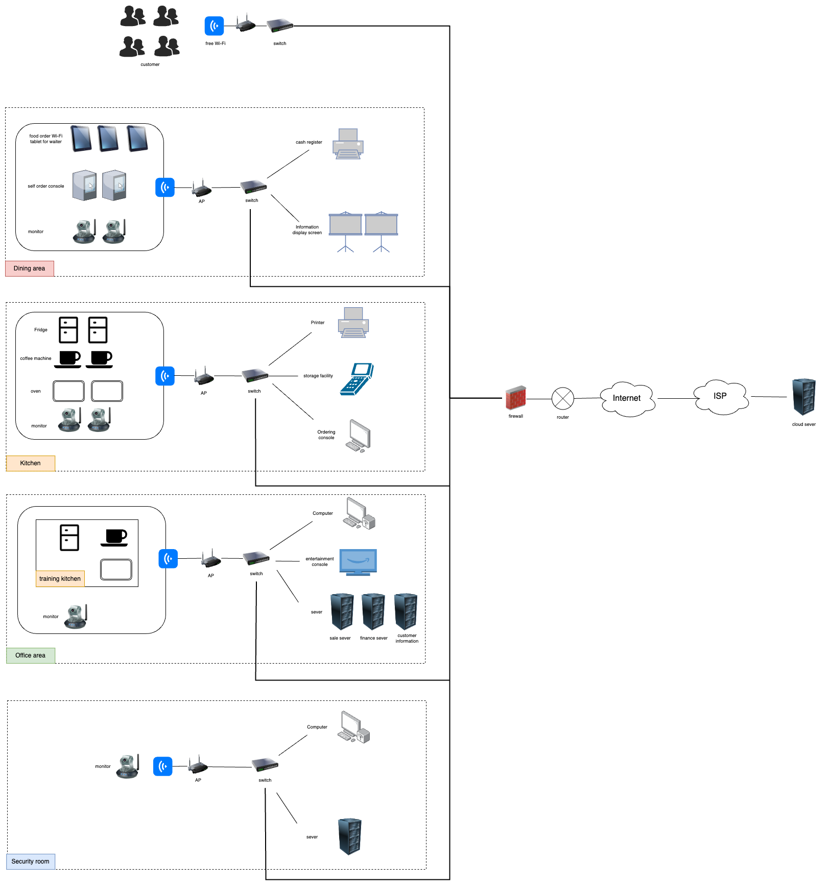
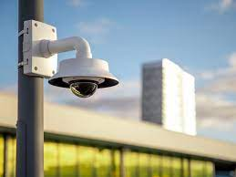
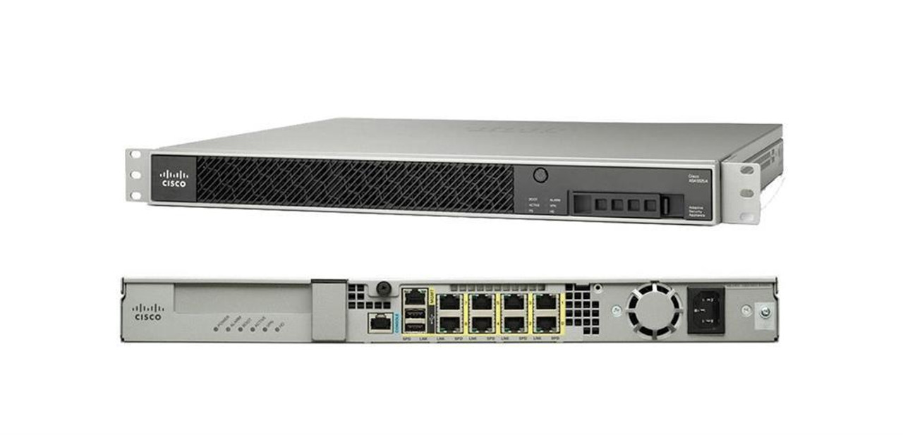
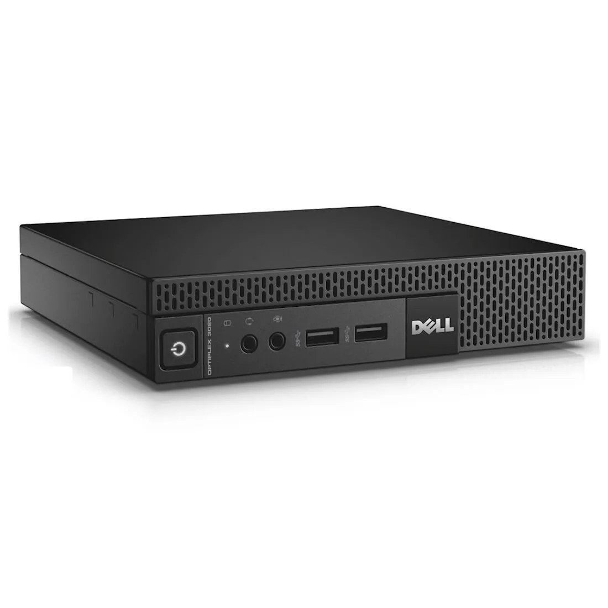
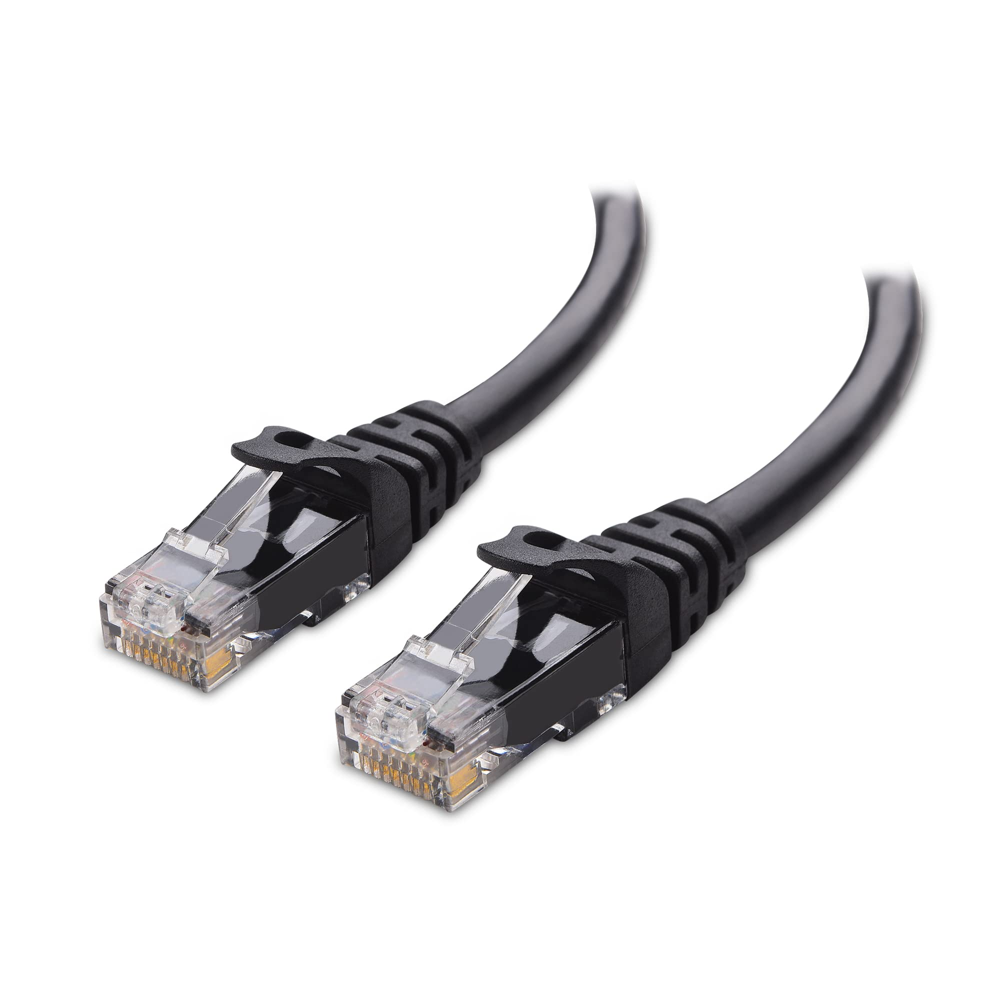
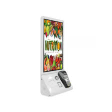

# Network Design
This section gives the detailed network design.

[Network Design Diagrams and Justifications](#network-design-diagrams-and-justifications) | [WiFi Design](#wifi-design) | [Address Allocations](#address-allocations) | [Recommended Hardware](#recommended-hardware) | [Plan](./plan.md) | [Cloud Services](./cloud.md) | [Security](./security.md) | [Reflection](./reflection.md) | [Return to index](./README.md)

## Network Design Diagrams and Justifications    
**Network Design Diagrams**

  

The following is the drawio of diagram.  

[project-network-design](images/network_design.drawio)    

**Justifications**
1. The entire restaurant shares the same network, but different areas include dining area, kitchen, office area, and security room. The main factor to consider when using independent subnets is physical distance. Different subnets are connected to the main router through a switch, and then different devices that require the network are connected to a switch or use an AP for Wi Fi connection, such as monitor camera, coffee machine, oven, food order tablet, Flexible devices like order console.    

2. Due to the need to set up a training kitchen in the Office area, a separate module will be set up with an oven, coffee machine, and fridge, providing network connection through Wi Fi.    

3. Server distinguishes between cloud server and local serve, with local serve placed in the Office area and security room.

4. Establish an independent subnet to provide customers with free Wi Fi and use AP to connect to the switch.

**Reasoning of the Key Decisions:**

Local Servers: We opted to include local servers for the restaurant as there might be secret recipes, financial data and personal membership information of the restaurant regulars. Thus we wanted to make the sensitive information more secure and decided to make the most critical information of the restaurant completely secure by keeping the data on our own servers.

Cloud Servers: We hosted some of our data on cloud servers because the information was non-sensitive and the people could access the restaurant website more faster through 3rd party services. Thus we decided to store the website data and emails data of the employees of the restaurant on cloud servers for faster access and cheap cost.

Wi-Fi Separation: We decided to separate the Wi-Fi for the restaurant into two different parts. One Wi-Fi for the guests and the 2nd for the Hosts and Employees and the electronic gadgets in the kitchen and head office. The Wi-Fi for the guests will have a different name and the data going around on that network will be totally different from the data that goes around on the restaurant network. This means that this will allow the restaurant wifi to have less traffic and the employees will be able to use the internet more effectively without any inturruptions and problems.

Security Cameras on Local Servers: We have designed the network such that the security cameras will be deployed on local server so that the camera quality remains steady. Normally, the video captured on cloud servers contains lag and lower resolutions. To fix that issue and capture high quality, we have decided to deploy the cameras on local servers.

Using an Access Point for All Wi-Fi controlled Appliances: The majority of appliances we are planning to use in the kitchen are Wi-Fi controlled appliances. Hence we are using an access point to connect the wireless gadgets to connect to the network via and access point that is connected to a switch which is connected to a router. The same goes for the appliances in the training kitchen and the entertainment console for the kitchen and the printers, etc.

Using a common firewall for the complete network ecosystem of the restaurant: Now, as we all know how dangerous it is not to have a firewall for your network. People might try to break the network, have unauthorised access and also try to steal personal information. Thus we decided to include a firewall to protect the data of the restaurant along with the data of the employees and guests. Also in the restaurant, we decided to separate the security server from the data server of the restaurant.

## WiFi Design

Restaurant WiFi Design:

    WiFi Names:
        Idea: Give different names to each WiFi network.
        Example: "Restaurant_Guest" and "Restaurant_Staff."
        Why: Keep things clear – one for visitors and one for employees.

    WiFi Security:
        Type: Use WPA3 for protection.
        What it does: Keeps your WiFi really safe from different problems.
        Why: WPA3 is the best and newest way to make sure your WiFi is secure.

    Guests and Staff Separation:
        Setup: Make a special area for guests in the network (like their own room).
        What it does: Keeps visitors' internet stuff away from the important office stuff.
        Why: It's safer when guest things don't mix with office things.

    Priority for Important Stuff:
        Setup: Make sure important things get attention first.
        What it does: Helps important stuff like cash registers work smoothly.
        Why: We want to be sure important jobs happen without any problems.
## Lets Design the Wi-Fi:

Lets create the name for the guest wifi named **Guest_Wi-Fi**

Lets name restaurant wifi as **Restaurant_Staff**

Both wifis will be of the encryption **WPA3**

Both the Guest and Staff Wi-fi's will be **separate**. 

Prioritize **Cash registers** and **Ordering Consoles** and **Staff Tablets** on the network.

Placement of the **access points** very carefully to cover the restaurant evenly.

## Address Allocations
| Name | ID |
| :--- | :-|
| Keiuom :| 12280508  |
| Rifat :| 12255229 | 
    
We will allocate the IPv4 address for the restaurant for the main dining, service area, office, and the security cameras based on the last two digits of student ID.    
**Subnet 1**  
| Type | Value |
| :--- | :-|
|Subnet:| 83.168.1.0/24|    
|Range: |83.168.1.1 to 83.168.1.254|    
|Gateway:| 83.168.1.1|    

**Subnet 2**  
| Type | Value |
| :--- | :-|
|Subnet:| 29.168.1.0/24    |
|Range:| 29.168.1.1 to 83.168.1.254    |
|Gateway:| 29.168.1.1  |

**Subnet 3**  
| Type | Value |
| :--- | :-|
|Subnet:| 29.83.1.0/24    |
|Range:| 29.83.1.1 to 29.83.1.254    |
|Gateway:| 29.83.1.1  |

## Recommended Hardware

Recommended Hardware:
Below is the recommended hardware with minimum specifications required by the company to function smoothly without and hiccups and issues (Excluding All kitchen Appliances for cooking):
We will need:
1.	Routers
2.	Switches
3.	Wireless Access Points
4.	Servers
5.	Security Cameras
6.	Firewall
7.	Systems
8.	Ethernet Cables
9.	Wi-Fi Tablets
10.	Self-Ordering Consoles
11.	Information Display Screens (TVs)
12.	Computers
13.	Entertainment Console
14.	Printers
15.	Cash Registers
What we need to take care of when buying is to try to buy stuff of quality and longevity and most importantly economy.
We need to fit the above hardware within constraint budget and only when we show that our budget requirement is better
than other competitors will the restaurant prioritize our company for the project.

Below is with images what we need for the project:

**Router**:
The minimum specifications we need in a router is
CPU: Quad-core processor
RAM: 4 GB minimum
Interfaces: Sufficient Ethernet ports for connecting to switches and other devices
Hence according to these specifications, we think the most economical and quality router will be the  Cisco ISR 4221. We will need 1 router.
The cost of this router will be : $ 1500

**Switches**:
The minimum specifications we need for the switches are:
Specifications:
Ports: 24 or 48 Ethernet ports
Layer: Layer 2 with optional Layer 3 capabilities
Power over Ethernet (PoE): If required for powering IP cameras or other devices (We need this because we need to install security camera in almost every room of the restaurant)
So according to these specifications we think the best switch will be the latest and economical CISCO 9200-48P switch. We need 5 switches.
The cost of this switch will be: $2500/switch*5 = $12500

**Wireless Access Points**:
The minimum specifications that we eed for the AP’s will be:
Specifications:
Wireless Standards: IEEE 802.11ac Wave 2
Dual-band support
MIMO (Multiple Input, Multiple Output) technology
So according to this specifications we think that the best Access Point is: CISCO 2800 Access Point. We will need 5 access points.
(insert image)
The cost of 1 Access point is $2000/AP * 5 = $12500

**Servers**:
The minimum specifications we need for a server are:
Specifications:
CPU: Quad-core or higher
RAM: 8 GB minimum
Storage: Adequate storage capacity based on data storage needs
Redundancy: Consider RAID configuration for data protection
According to this sepcifications, we suggest the best server will be the Dell PowerEdge R7615 Server because of its economical pricing. We will need 2 of these servers one in the office and another one in the security room.
The price of this server is $8000/server * 2 = $16000

**Security Cameras**:
Specifications:
Resolution: 1080p or higher
PoE support for simplified installation
IP rating for outdoor use if applicable
According to these specifications, we suggest the best camera brand is the Axis Communications P32 Series. We will need 6 of these cameras along with the server and monitor.
This setup will cost us $8000 along with the installations including all 6 cameras.

**Firewall**:
The specifications we require for the firewall is:
Specifications:
Throughput: Sufficient for expected network traffic
Security features: VPN support, intrusion prevention, etc.
So according to these specifications the best Firewall will be the CISCO 5525-CU-K9 model.
This will cost us $5000 for the firewall.

**Systems**:
These systems will be required for efficient managing and processing of the orders. For this not a mid range budget system is enough. The recommended PC is Dell OptiPlex 9020 mini.
(image here)
The cost will be approximately 500 dollars for the setup * 2 = $1000

**Ethernet Cables**:
We will need atleast 100 meters cable for the whole project.
Cost will be $10 per meter, so 10*100 = $1000 dollars for cables.

**Wi-Fi Tablets**:
The minimum specification requirement for wi-fi tablets are:
Any IPad or android tablet with WI-FI capabilities.
Cost will be $500 per tablet, so we need 3 tablets. $500*3 = $1500

**Self Ordering Consoles**:

The minimum requirement is a basic ordering console with touch capabilities.
The choice of selection will be the Lightspeed Restaurant POS Service system.
The cost of installing 3 of these will be $1500 plus the maintainence costs.

**Information Display Screens**:

Cost: $500 per screen

**Entertainment Console**:

Cost: $2000 per setup
Printers:
Cost: $250 * 4 = $1000
Cash Registers:
Cost $500/set for front desk

